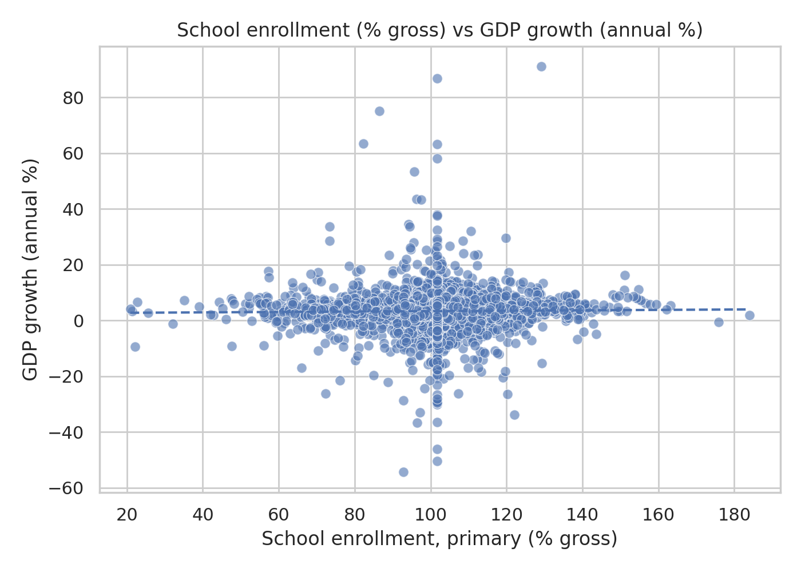
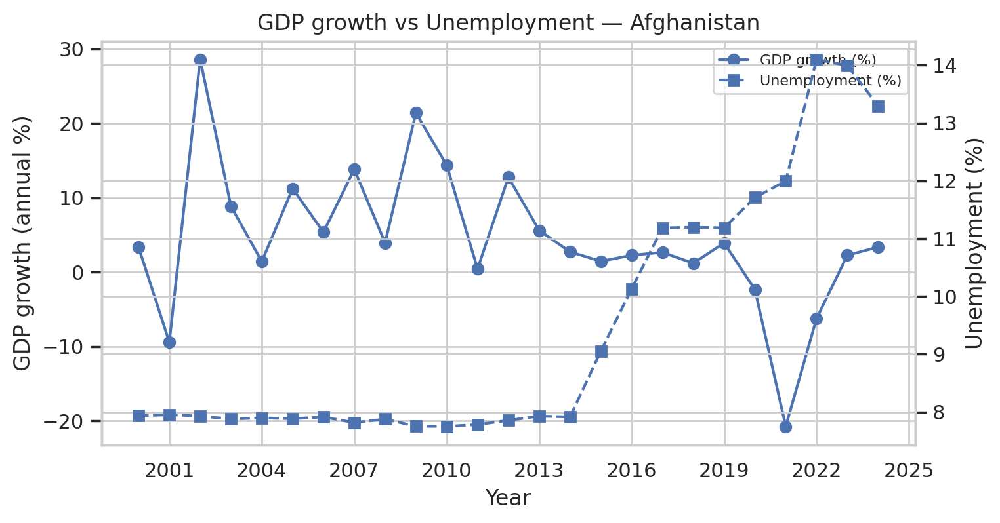
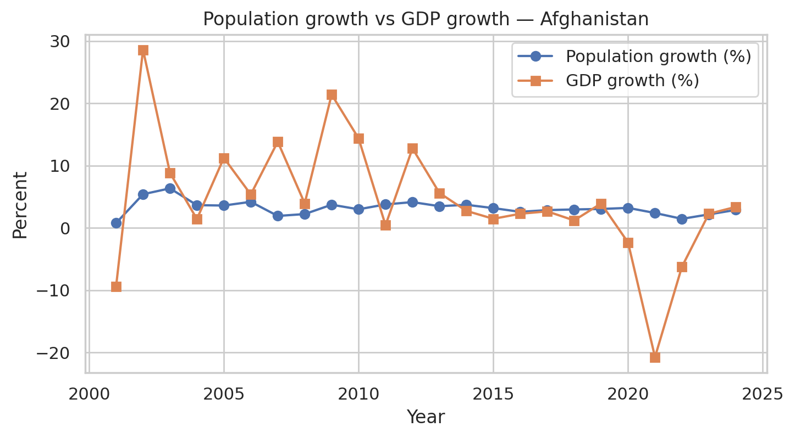

# Global Development Indicators Dataset  
### Final Project – DSCI 511  
### Team Members: Chukwuma Chinomso | Eric Wang | Lohitha Rasakonda | Ahmed Syed

## Overview  
This project constructs a **multi-indicator global development dataset** using the **World Bank Open Data API**.  
We focus on six key indicators from 2000 to 2024:

- GDP growth (annual %)
- Population total
- School enrollment (primary, % gross)
- Poverty headcount ratio ($2.15/day)
- Internet usage (% of population)
- Unemployment (% of labor force)

Our goal is to explore how **population**, **education**, and **economic performance** relate across countries, and to provide a clean, reusable dataset for future analysis.

##  Data Source  
All data is collected from the **World Bank Open Data API**  
- https://api.worldbank.org/v2  

The API returns data in **JSON format**, which we converted into a **tabular dataset (CSV)**.

Indicators used:
- `NY.GDP.MKTP.KD.ZG` – GDP growth
- `SP.POP.TOTL` – Population
- `SE.PRM.ENRR` – School enrollment (primary)
- `SI.POV.DDAY` – Poverty headcount ratio ($2.15/day)
- `IT.NET.USER.ZS` – Internet usage
- `SL.UEM.TOTL.ZS` – Unemployment

## Data Acquisition Approach
- Sent JSON API requests for all countries (excluding aggregate regions)
- Filtered years 2000–2024
- Converted all responses into Pandas DataFrames
- Pivoted the dataset to form a clean **country-year** table
- Stored final dataset as `processed_data.csv`

## Data Cleaning & Preprocessing
- Converted JSON → tabular format  
- Pivoted indicators into columns  
- Filled missing numeric values with column means  
- Computed summary statistics  
- Created additional derived fields (population growth %)  
- Exported summary tables for reproducibility  

## Analysis & Visualizations  

### 1 Pearson Correlation Matrix  
Shows correlations between all six indicators.

./output/country_school_gdp_correlations.csv)

### 2 School Enrollment vs GDP Growth  
Global relationship between education levels and economic growth.

### 3 GDP Growth vs Unemployment (Afghanistan Example)  
GDP fluctuates heavily while unemployment stays steady, showing they don’t always move together.

### 4 Population Growth vs GDP Growth  
Population changes are stable, but GDP is highly volatile.

## Potential Use Cases  
- Academic analysis of global development trends  
- Policy discussions on education, internet access, and poverty  
- Baseline dataset for ML models predicting development indicators  
- Statistical exploration of cross-country relationships  

## Distribution Plan  
- Documentation (Data Dictionary)
Includes definitions of each indicator, units of measurement, and the preprocessing steps applied.
This ensures clarity, transparency, and easy onboarding for anyone using or extending the dataset.

- Reproducibility (World Bank API)
All data is sourced from the publicly available World Bank Open Data API, meaning the dataset can be fully recreated at any time.
The acquisition code in our notebook automatically queries the API, processes the responses, and reconstructs the dataset.

- Dataset Files
The cleaned dataset (processed_data.csv), summary statistics, per-country correlations, and visualizations are included for immediate use.

- Code Availability
Jupyter Notebook (.ipynb) and Python scripts show the exact steps for acquisition, cleaning, and analysis, ensuring complete reproducibility. 

## Challenges & Limitations  
- Missing values for several indicators  
- Countries report inconsistently  
- Correlations are weak globally; deeper regional analysis needed  
- API occasionally returns incomplete pages or rate limits  
- Some indicators reflect annual summaries and miss short‑term shocks  

## Workload Distribution  
- **Mishael** – Primary coder, supported in documentation and analysis 
- **Eric** – Presentation, documentation, analysis and supported in code development
- **Lohitha** – Presentation, documentation, analysis and supported in code development 
- **Ahmed** – Gave input during Project Proposal and assisted in presentation development
  

## How to Run  
        If running on Google colab uncomment this section

        `google.colab import drive
        drive.mount('/content/drive')`
1. Open Notebook
2. Depending on your IDE (If using Google Colab don't pip install but if using pycharm, vscode etc, run `pip install requirement.txt`)
2. Run all cells to fetch data and generate outputs.  
3. Processed dataset + figures will be saved into output directory.

---

## Final Notes  
This dataset is ready for reuse and further development.
